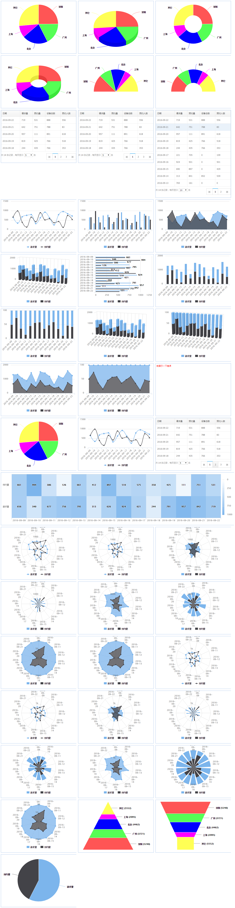

# 报表系统前端展现引擎

[查看Demo](demo/)   
[项目说明](#intro)   
[例图](#normal)   
[趋势图](#trend)   
[表格](#table)   
[项目组件](#require)

## 项目说明
	
	由于项目对报表展示有很大的需求 对Highchats进行了一次简单封装,只要开发人员关心后端数据的组织就可以方便输出各种图表
	
	目前只支持chrome 其它浏览器还未做兼容处理

	目前支持3种图表展示(表格table,例图normal,趋势图trend)

## 兼容支持
	
	tip: 目前有测试过浏览器和版本,不代表不支持低版本或其它浏览器

	Chrome 54
	Opera 42
	FireFox 50
	IE (暂时未知 反正IE8有出现报错了)

## Demo

## 例图(normal)
	
	支持类型 
		饼图   pie,pie_3d
		环形图 circular,circular_3d
		扇形图 sector,circular_sector,
		金字塔 pyramid
		管道图 funnel

### 数据格式(remote返回数据)
	
	{
	    "code":0,
	    "msg":null,
	    "data":{
	        "type":"pie",
	        "config":{
	            "field_list":{  // 字段名字描述
	                "sz":"深圳",
	                "gz":"广州",
	                "bj":"北京",
	                "sh":"上海",
	                "other":"其它"
	            },
	            "color_list":{     // 颜色配置(如果为空 则使用Highcharts默认)
	                "sz":"#FF5555",
	                "gz":"#55FF55",
	                "bj":"#0000FF",
	                "sh":"#FF00FF",
	                "other":"#FFFF55"
	            },
	            "line_list":{  // 线须配置 目前只有少数趋势图支持
	            }
	        },
	        "data":[ // 展现的数据格式
	            {
	                "total_num":"8070",
	                "sz":"5240",
	                "gz":"3721",
	                "bj":"4462",
	                "sh":"2095",
	                "other":"5552"
	            }
	        ]
	    }
	}

### 数据格式(使用report-data绑定)

	参看文件 normal_chart.data （其实就是remote数据的data部分做了json_encode和url_encode的处理）
	
	php:(参看data.php)
		echo urlencode(json_encode($data));

## 趋势图(trend)
	
	支持类型 
		曲图 spline,
		面积图 area,bar,area_pile,area_percent
		柱状图 column,column_3d,column_pile,column_pile_3d,column_percent_3d
		热区图 heatmap
        蛛网图 spiderweb,spiderweb_line,
			  spiderweb_area,spiderweb_area_pile,spiderweb_area_percent
		      spiderweb_column,spiderweb_column_pile,spiderweb_column_percent
        极地图 polar,polar_line,
			  polar_area,polar_area_pile,polar_area_percent
		      polar_column,polar_column_pile,polar_column_percent

### 数据格式(remote返回数据)
	
	{
	    "code":0,
	    "msg":null,
	    "data":{
	        "type":"bar",
	        "config":{
	            "field_list":{
	                "book.count":"请求量",
	                "book.success_count":"预约量"
	            },
	            "color_list":[],
	            "line_list":[]
	        },
	        "data":{
	            "2016-09-09":{
	                "book.count":"656",
	                "book.success_count":"661"
	            },
	            "2016-09-10":{
	                "book.count":"340",
	                "book.success_count":"994"
	            },
	            "2016-09-11":{
	                "book.count":"677",
	                "book.success_count":"386"
	            },
	            "2016-09-12":{
	                "book.count":"756",
	                "book.success_count":"126"
	            }
	        }
	    }
	}

### 数据格式(使用report-data绑定)

	参看文件 trend_chart.data （其实就是remote数据的data部分做了json_encode和url_encode的处理）
	
	php:(参看data.php)
		echo urlencode(json_encode($data));

## 表格(table)
	
	支持类型 table

### 数据格式(remote返回数据)
	
	{
	    "code":0,
	    "msg":null,
	    "data":{
	        "type":"table",
	        "config":{
	            "stat_date":{
	                "thText":"日期",
	                "width":160
	            },
	            "book.count":{
	                "thText":"请求量"
	            },
	            "book.success_count":{
	                "thText":"预约量"
	            },
	            "book.terminal_count":{
	                "thText":"设备总数"
	            },
	            "book.postman_count":{
	                "thText":"预约人数"
	            }
	        },
	        "data":[
	            {
	                "stat_date":"2016-09-22",
	                "book.count":"719",
	                "book.success_count":"531",
	                "book.terminal_count":"888",
	                "book.postman_count":"556"
	            },
	            {
	                "stat_date":"2016-09-21",
	                "book.count":"642",
	                "book.success_count":"751",
	                "book.terminal_count":"788",
	                "book.postman_count":"83"
	            },
	            {
	                "stat_date":"2016-09-20",
	                "book.count":"957",
	                "book.success_count":"111",
	                "book.terminal_count":"891",
	                "book.postman_count":"618"
	            }
	        ]
	    }
	}

### 数据格式(使用report-data绑定)

	参看文件 table.data （其实就是remote数据的data部分做了json_encode和url_encode的处理）
	
	php:(参看data.php)
		echo urlencode(json_encode($data));
	
	

## 项目组件

	jQuery（必需，本前端项目就是一个jQuery插件）
	
		https://github.com/jquery/jquery

	HighCharts (如果要展示图型的话)
	
		https://github.com/highcharts/highcharts
	
	gri.dataTable (如果要展示表格的话)
	
		https://github.com/johnnyzheng/GRI

	jQuery showLoading plugin(取远程数据需要转菊花的话)

		https://github.com/rrx/jquery.showLoading

## 更新说明

	2017.01.04 项目init   
	2017.01.05 修改变量为全局的问题，新增报表自动刷新间隔设置
	2017.01.09 新增热区图,蛛网图,极地图,金字塔,管道图